# Skills Marketplace Agents

Five specialized AI agents that power skill discovery, recommendation, validation, testing, and authoring for AI skill ecosystems. Built on agentic graph RAG with a Neo4j knowledge graph, vector embeddings, and a Skill Catalog API -- all exposed as A2A-compliant microservices deployable to Kubernetes via [Kagenti](https://github.com/kagenti/kagenti).

## Why Agentic Graph RAG for Skills?

AI skills are not isolated artifacts. A Kubernetes deployment skill _depends on_ container building, _complements_ CI/CD pipelines, and _is an alternative to_ serverless deploy. These relationships form a rich knowledge graph that naive keyword search cannot navigate.

Skills Marketplace Agents combines **three retrieval strategies** into a unified agentic architecture:

1. **Structured graph traversal** -- Cypher queries walk explicit dependency chains, complementary workflows, and domain clusters
2. **Semantic vector search** -- 768-dimension embeddings (cosine similarity) find skills by meaning, not keywords
3. **Hybrid retrieval** -- vector search seeds graph expansion, combining the precision of structured queries with the recall of semantic matching

Each agent autonomously decides which strategy to use based on the user's question, making retrieval truly _agentic_ rather than pipeline-based.

## Architecture

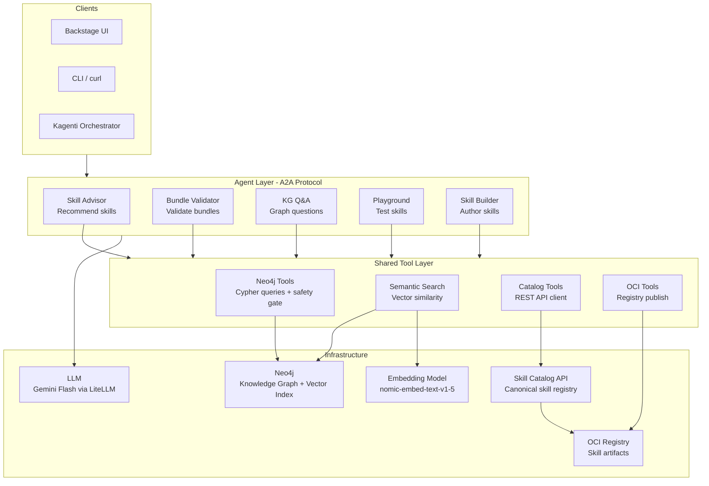

### Request Flow: "Recommend skills for Kubernetes"

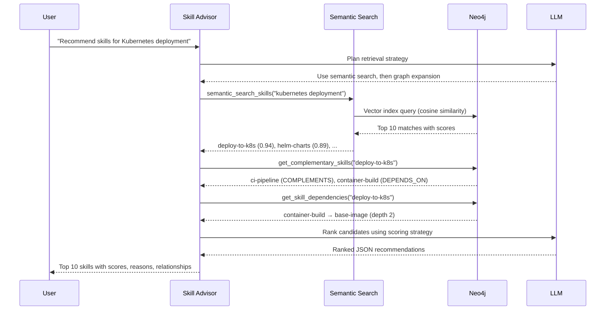

## The Five Agents

| Agent | Skill Patterns | Key Tools | Purpose |
|-------|---------------|-----------|---------|
| **Skill Advisor** | Inline + File-based | `semantic_search_skills`, `search_skill_catalog`, graph traversal tools | Recommends complementary skills using hybrid graph RAG |
| **Bundle Validator** | File-based | `get_skill_detail`, `get_skill_versions`, dependency/alternative checks | Validates skill bundles for completeness and redundancy |
| **KG Q&A** | File-based | `query_skill_graph`, `semantic_search_skills`, `get_graph_context` | Answers natural-language questions grounded in the knowledge graph |
| **Playground** | File-based + External | `search_skill_catalog`, `get_skill_content` | Tests individual skills interactively against a live agent |
| **Skill Builder** | Meta Skill Factory | `validate_skill_yaml`, `publish_skill_to_oci`, `trigger_catalog_sync` | Generates new skill specifications and publishes to OCI |

## Skill Patterns

The agents use four skill patterns with **progressive disclosure** to minimize context window usage while keeping deep knowledge accessible:

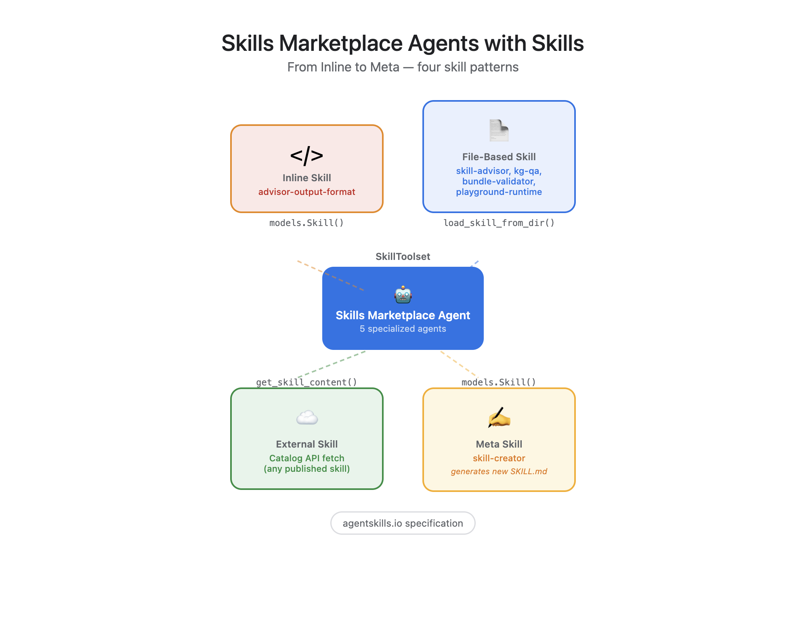

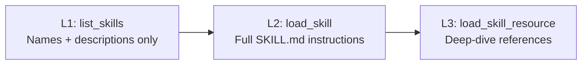

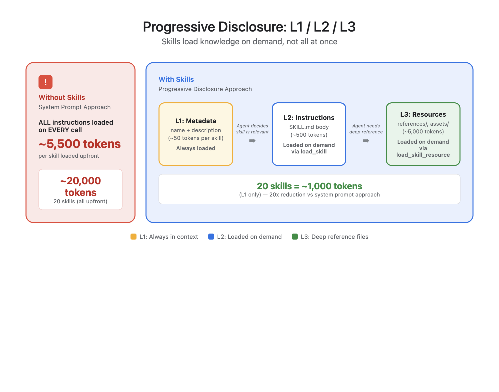

### Pattern 1: Inline Skill

Small, stable skill definitions embedded directly in Python code. Ideal for output format schemas that rarely change.

```python
_output_format_skill = models.Skill(
    frontmatter=models.Frontmatter(
        name="advisor-output-format",
        description="JSON output format for skill recommendation cards.",
    ),
    instructions=(
        "When returning skill recommendations, use this JSON array format:\n"
        '[{"skill_name": "deploy-to-k8s", "score": 0.92, '
        '"reason": "...", "category": "DevOps", '
        '"relationship": "COMPLEMENTS build-container"}]'
    ),
)
```

**Used by:** Skill Advisor (output format schema)

### Pattern 2: File-Based Skill

Skills defined as `SKILL.md` files with optional `references/` for L3 deep-dive resources. The agent loads instructions on demand via progressive disclosure.

```
agents/kg_qa/skills/kg-qa/
├── SKILL.md                          # L2: Query methodology
└── references/
    ├── graph-schema.md               # L3: Full node/edge schema
    └── cypher-patterns.md            # L3: 20+ reusable Cypher templates
```

**Used by:** All five agents for their core methodologies

### Pattern 3: External Skill

Skills fetched at runtime from external sources. The Playground agent retrieves `SKILL.md` content directly from the Skill Catalog API and follows it as if the skill were local.

```python
# Agent fetches skill from Catalog API at runtime
skill_content = get_skill_content("business", "document-reviewer", "1.0.0")
# Agent then follows the fetched SKILL.md instructions
```

**Used by:** Playground (dynamic skill loading from Catalog API or session state)

### Pattern 4: Meta Skill Factory

A skill whose purpose is to create other skills. The Skill Builder embeds the `agentskills.io` specification, a working example, and an OCI publishing guide as L3 resources.

```python
_skill_creator = models.Skill(
    frontmatter=models.Frontmatter(
        name="skill-creator",
        description="Creates new skill definitions from requirements.",
    ),
    instructions="...",
    resources=models.Resources(
        references={
            "skill-spec.md": _SPEC_CONTENT,         # agentskills.io format
            "skill-example.md": _EXAMPLE_CONTENT,    # Working code-review example
            "oci-publish-guide.md": _OCI_GUIDE_CONTENT,  # Publishing workflow
        }
    ),
)
```

**Used by:** Skill Builder (generates and publishes new skills)

### SkillToolset: How Skills Become Tools

At runtime, three auto-registered tools enable progressive disclosure without any custom plumbing:

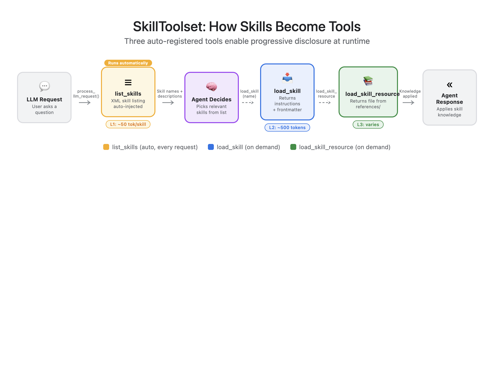

## Agentic Graph RAG

The knowledge graph stores skills, their relationships, and vector embeddings in Neo4j. Agents query it through three complementary retrieval paths.

### Knowledge Graph Schema

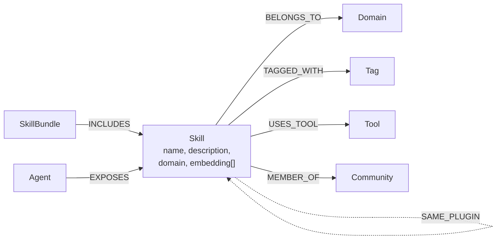

**Solid lines** = deterministic metadata relationships. **Dashed lines** = semantic/embedding-derived relationships with confidence scores.

### Three Retrieval Paths

**1. Structured Cypher (Graph Traversal)**

Direct graph queries for precise, relationship-aware retrieval. The agent generates Cypher queries using documented templates from `cypher-patterns.md`.

```cypher
-- Find skills that complement deploy-to-k8s with high confidence
MATCH (s:Skill) WHERE s.name = $identifier OR s.id = $identifier
MATCH (s)-[r:COMPLEMENTS]-(other:Skill)
WHERE coalesce(r.confidence, 1.0) >= 0.6
RETURN coalesce(other.name, other.id) AS skill,
       r.confidence AS confidence, r.description AS reason
ORDER BY r.confidence DESC
```

**2. Semantic Vector Search**

768-dimensional embeddings (nomic-embed-text-v1-5) stored on each Skill node, indexed with cosine similarity. Finds skills by meaning when the user's query doesn't match exact names.

```cypher
CALL db.index.vector.queryNodes('skill_embedding_idx', $top_k, $embedding)
YIELD node, score
RETURN coalesce(node.name, node.id) AS skill, score
ORDER BY score DESC
```

**3. Hybrid (Vector + Graph Expansion)**

Seeds with vector search, then expands through graph relationships to discover skills not directly similar but structurally relevant.

```cypher
CALL db.index.vector.queryNodes('skill_embedding_idx', $top_k, $embedding)
YIELD node, score
OPTIONAL MATCH (node)-[:COMPLEMENTS|DEPENDS_ON|SAME_PLUGIN]-(neighbor:Skill)
WITH DISTINCT skill, max(score) AS best_score
RETURN coalesce(skill.name, skill.id) AS skill_name, best_score
ORDER BY best_score DESC LIMIT $limit
```

### Recommendation Scoring

The Skill Advisor combines signals from all three paths into a composite score:

| Signal | Weight | Source |
|--------|--------|--------|
| Semantic similarity | 0.40 | Vector cosine distance |
| Graph proximity | 0.25 | Shortest path to cart skills |
| Dependency relevance | 0.20 | Transitive DEPENDS_ON chain |
| Domain coverage | 0.15 | Fills unrepresented domain |

Bonuses: +0.15 for direct DEPENDS_ON targets, +0.10 for COMPLEMENTS edges. Skills with SIMILAR_TO > 0.85 to a cart skill are flagged as potentially redundant.

### Embedding Pipeline

```bash
# Bootstrap embeddings for all skills in Neo4j
python scripts/bootstrap_embeddings.py
```

This script:
1. Creates a 768-dim cosine vector index (`skill_embedding_idx`)
2. Embeds all skills in batches of 32 via the embedding endpoint
3. Materializes `SIMILAR_TO` edges between skills with cosine similarity >= 0.70

### Cypher Safety Gate

All LLM-generated Cypher goes through a two-layer defense:

1. **Allowlist** -- query must start with `MATCH`, `OPTIONAL MATCH`, `RETURN`, `WITH`, `UNWIND`, or `CALL db.*`
2. **Blocklist** -- rejects `DELETE`, `CREATE`, `MERGE`, `SET`, `DROP`, `REMOVE`, `LOAD CSV`

### Query Cache

An in-memory TTL cache (300s, 256 entries) avoids redundant Neo4j round-trips for repeated queries. Queries with large vector parameters are automatically excluded.

## Skill Catalog API

The [Skill Catalog API](https://github.com/redhat-et/skillimage) is the canonical source of truth for skill metadata. It reads from an OCI registry (Quay.io) and provides a REST interface for browsing, searching, and retrieving skill content.

### Data Flow

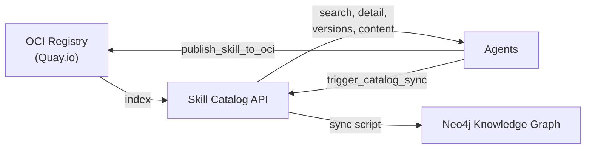

### Catalog Tools

| Tool | Description |
|------|-------------|
| `search_skill_catalog` | Free-text search with filters (status, namespace, tags, compatibility) |
| `get_skill_detail` | Full metadata for a specific skill (latest version) |
| `get_skill_versions` | All versions of a skill with lifecycle status |
| `get_skill_content` | Raw SKILL.md markdown content for a specific version |
| `trigger_catalog_sync` | Trigger the catalog to re-sync from its OCI registry |

### Syncing Catalog to Neo4j

```bash
# Pull skills from Catalog API into Neo4j knowledge graph
python scripts/sync_catalog_to_neo4j.py

# Export existing Neo4j skills to OCI → Catalog API
python scripts/export_skills_to_catalog.py
```

## Agent-to-Agent (A2A) Protocol

Each agent exposes the [A2A protocol](https://google.github.io/A2A) for interoperability:

- `GET /.well-known/agent-card.json` -- Agent card for discovery (name, capabilities, skills)
- `POST /` -- JSON-RPC endpoint (`message/send`, `message/stream`)
- `GET /healthz` -- Liveness probe
- `GET /readyz` -- Readiness probe (checks Neo4j connectivity)

```bash
# Discover agent capabilities
curl http://localhost:8001/.well-known/agent-card.json | jq .

# Send a task
curl -X POST http://localhost:8001/ \
  -H "Content-Type: application/json" \
  -d '{
    "jsonrpc": "2.0",
    "method": "message/send",
    "id": "1",
    "params": {
      "message": {
        "messageId": "msg-001",
        "role": "user",
        "parts": [{"kind": "text", "text": "Recommend skills for Kubernetes"}]
      }
    }
  }'
```

## Getting Started

### Prerequisites

| Requirement | Version | Notes |
|------------|---------|-------|
| Python | >= 3.11 | Tested with 3.12 |
| Neo4j | >= 5.0 | With APOC and vector index support |
| LLM endpoint | OpenAI-compatible | Gemini Flash via LiteLLM recommended |
| Embedding endpoint | OpenAI-compatible | nomic-embed-text-v1-5 (768 dims) |

### Setup

```bash
# Clone and install
git clone <repo-url> && cd smp-agents
python -m venv .venv && source .venv/bin/activate
pip install -e ".[dev]"

# Configure secrets
cp .env.example .env
# Edit .env: set NEO4J_PASSWORD and any endpoint overrides

# Bootstrap embeddings (requires running Neo4j + embedding model)
python scripts/bootstrap_embeddings.py

# Run any agent
PYTHONPATH=. uvicorn agents.skill_advisor.server:app --host 0.0.0.0 --port 8001
PYTHONPATH=. uvicorn agents.bundle_validator.server:app --host 0.0.0.0 --port 8002
PYTHONPATH=. uvicorn agents.kg_qa.server:app --host 0.0.0.0 --port 8003
PYTHONPATH=. uvicorn agents.playground.server:app --host 0.0.0.0 --port 8004
PYTHONPATH=. uvicorn agents.skill_builder.server:app --host 0.0.0.0 --port 8005

# Verify
curl http://localhost:8001/.well-known/agent-card.json | jq .name
```

### GitOps Deployment (Kagenti + ArgoCD)

The repo includes full Kustomize manifests and an ArgoCD Application for GitOps deployment to OpenShift with Kagenti.

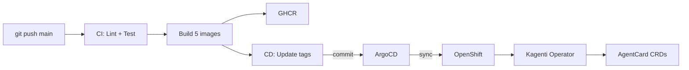

**How it works:**

1. Push to `main` triggers CI -- lint, unit tests, and container builds for all 5 agents
2. CI pushes images to GHCR (`ghcr.io/rrbanda/smp-agents/<agent>:sha-<commit>`)
3. CD workflow updates image tags in `k8s/overlays/dev/kustomization.yaml` and commits
4. ArgoCD detects the commit and auto-syncs Deployments, Services, and Routes
5. Kagenti operator sees `kagenti.io/type=agent` labels and auto-creates AgentCard CRDs
6. Agents are discoverable via A2A protocol at `/.well-known/agent-card.json`

```bash
# One-time: apply the ArgoCD Application
oc apply -f k8s/argocd/application.yaml

# Verify sync status
oc get application.argoproj.io smp-agents -n openshift-gitops

# Check agent cards
oc get agentcards -n smp-agents
```

**Kustomize structure:**

```
k8s/
├── base/                          # Portable base manifests
│   ├── kustomization.yaml
│   ├── namespace.yaml
│   ├── configmap.yaml             # smp-config (config.yaml for cluster)
│   ├── secret.yaml                # smp-secrets (NEO4J_PASSWORD placeholder)
│   └── <agent>/                   # Per-agent Deployment + Service (x5)
├── overlays/
│   └── dev/                       # Dev cluster overlay
│       ├── kustomization.yaml     # Image tags (updated by CD workflow)
│       ├── httproutes.yaml        # OpenShift Routes for external access
│       └── patches/
│           └── secret-override.yaml
└── argocd/
    └── application.yaml           # ArgoCD Application (auto-sync + self-heal)
```

Each Deployment includes liveness (`/healthz`) and readiness (`/readyz`) probes, resource limits, ConfigMap volume mount, and secret references.

### Manual Kagenti Deployment

Alternatively, deploy via the Kagenti API script:

```bash
# Requires: oc login, GitHub repo pushed
./scripts/deploy_kagenti.sh
```

## Configuration

All non-secret config lives in [`config.yaml`](config.yaml). Secrets use `${VAR_NAME}` syntax resolved from environment variables.

### Environment Variables

| Variable | Required | Default | Description |
|----------|----------|---------|-------------|
| `NEO4J_PASSWORD` | Yes | -- | Neo4j database password |
| `LLAMASTACK_API_KEY` | No | `not-needed` | API key for LLM endpoint |
| `LLM_MODEL_ID` | No | `openai/gemma-4-31b-it` | LiteLLM model identifier |
| `LLM_API_BASE` | No | cluster-internal | OpenAI-compatible LLM base URL |
| `EMBEDDING_API_BASE` | No | LlamaStack route | Embedding model endpoint |
| `NEO4J_URI` | No | cluster-internal bolt | Neo4j Bolt URI |
| `NEO4J_HTTP_URL` | No | derived from bolt | Neo4j HTTP Transactional API URL |
| `SKILL_CATALOG_URL` | No | cluster route | Skill Catalog API base URL |
| `OCI_REGISTRY_URL` | No | cluster registry | OCI registry for skill artifacts |
| `LOG_LEVEL` | No | `INFO` | Python logging level |

### Config Sections

| Section | Purpose |
|---------|---------|
| `model.agent` | LLM endpoint (id, api_base, api_key) |
| `model.embedding` | Embedding model (id, dimension, api_base) |
| `neo4j` | Graph database connection (uri, http_url, user, password, database) |
| `catalog` | Skill Catalog API (base_url) |
| `oci` | OCI registry (registry_url, namespace, cache_ttl_seconds) |
| `a2a` | A2A provider metadata (organization, url) |
| `agents.*` | Per-agent config (name, description, host, port, a2a version) |

## Testing and CI

### Three-Layer Test Strategy

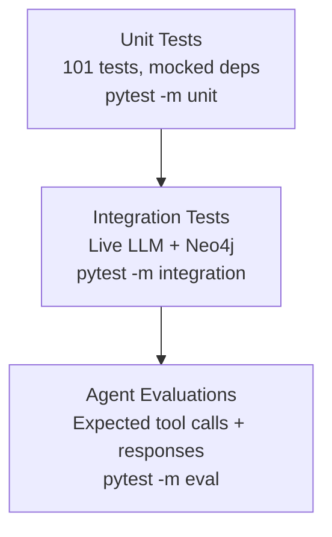

**Unit tests** mock all external dependencies (Neo4j, LLM, Catalog API) and verify tool logic, Cypher safety, agent construction, and input validation.

**Integration tests** run agents against a live LLM and Neo4j instance to verify end-to-end tool invocation.

**Agent evaluations** use conversation scenario datasets (`agents/*/evals/*.test.json`) with expected tool calls and responses. Custom metrics include `tool_coverage` (verifies agents use domain-specific tools, not just framework tools).

```bash
# Run unit tests
pytest tests/ -m unit -v

# Run evals (requires live LLM + Neo4j)
pytest tests/test_agent_evals.py -m eval -v
```

### CI/CD Pipeline (GitHub Actions)

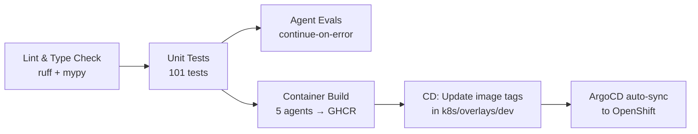

- **CI** (`.github/workflows/ci.yml`):
  - **Lint**: `ruff check`, `ruff format --check`, `mypy`
  - **Unit Tests**: All `pytest -m unit` tests
  - **Agent Evals**: Runs on push/dispatch only, skips gracefully if LLM secrets not configured
  - **Container Build**: Matrix build of 5 agent Dockerfiles, pushed to GHCR (main branch only)

- **CD** (`.github/workflows/cd.yml`):
  - Triggered after CI completes on main, or via `workflow_dispatch`
  - Updates `newTag` in `k8s/overlays/dev/kustomization.yaml` to `sha-<commit>`
  - Commits and pushes; ArgoCD detects and syncs to the cluster

## Project Structure

```
smp-agents/
├── config.yaml                           # All non-secret configuration
├── .env.example                          # Secret templates
├── pyproject.toml                        # Python package + tool config
├── README.md
│
├── shared/                               # Shared Python package
│   ├── model_config.py                   # YAML config loader + LiteLLM factory
│   ├── neo4j_tools.py                    # Graph query tools + Cypher safety + cache
│   ├── semantic_search_tools.py          # Vector embedding search tools
│   ├── catalog_tools.py                  # Skill Catalog API REST client tools
│   ├── oci_tools.py                      # OCI registry publish + validate tools
│   ├── eval_metrics.py                   # Custom agent evaluation metrics
│   └── health.py                         # Kubernetes health check endpoints
│
├── agents/
│   ├── skill_advisor/                    # Patterns 1 + 2
│   │   ├── agent.py                      # Inline output format + file-based methodology
│   │   ├── server.py                     # A2A entrypoint
│   │   ├── Dockerfile
│   │   ├── skills/skill-advisor/         # L2 SKILL.md + L3 references/
│   │   └── evals/                        # Evaluation datasets
│   │
│   ├── bundle_validator/                 # Pattern 2
│   │   ├── agent.py                      # File-based validation rules
│   │   ├── server.py
│   │   ├── Dockerfile
│   │   ├── skills/bundle-validator/      # L2 + L3 validation-rules.md, dependency-patterns.md
│   │   └── evals/
│   │
│   ├── kg_qa/                            # Pattern 2
│   │   ├── agent.py                      # File-based Cypher query + hybrid search
│   │   ├── server.py
│   │   ├── Dockerfile
│   │   ├── skills/kg-qa/                 # L2 + L3 graph-schema.md, cypher-patterns.md
│   │   └── evals/
│   │
│   ├── playground/                       # Patterns 2 + 3
│   │   ├── agent.py                      # File-based testing + external skill fetch
│   │   ├── server.py
│   │   ├── Dockerfile
│   │   ├── skills/playground-runtime/    # L2 + L3 testing-guide.md
│   │   └── evals/
│   │
│   └── skill_builder/                    # Pattern 4 (Meta Skill Factory)
│       ├── agent.py                      # Inline models.Skill + models.Resources
│       ├── server.py
│       ├── Dockerfile
│       └── evals/
│
├── scripts/
│   ├── bootstrap_embeddings.py           # Generate embeddings + SIMILAR_TO edges
│   ├── sync_catalog_to_neo4j.py          # Pull Catalog API → Neo4j
│   ├── export_skills_to_catalog.py       # Push Neo4j → OCI → Catalog API
│   ├── sync_oci_skills.py                # Legacy OCI → Neo4j sync
│   └── enrich_graph.py                   # Graph enrichment (communities, edges)
│
├── tests/
│   ├── test_neo4j_tools.py               # Neo4j tools + Cypher safety
│   ├── test_semantic_search.py           # Embedding search tools
│   ├── test_catalog_tools.py             # Catalog API tools
│   ├── test_oci_tools.py                 # OCI registry tools
│   ├── test_agent_construction.py        # Agent wiring + tool registration
│   ├── test_agent_evals.py               # ADK evaluation runner
│   ├── test_integration_agents.py        # Live LLM + Neo4j integration
│   └── test_model_config.py              # Config loader
│
├── k8s/                                  # GitOps manifests
│   ├── base/                             # Kustomize base (Deployments, Services, ConfigMap)
│   ├── overlays/dev/                     # Dev overlay (Routes, image tags, secrets)
│   └── argocd/                           # ArgoCD Application (auto-sync)
│
├── .github/workflows/
│   ├── ci.yml                            # Lint → Unit → Evals → Container Build
│   ├── cd.yml                            # Update image tags → ArgoCD sync
│   └── e2e.yml                           # End-to-end tests on OpenShift
│
└── Dockerfile.*                          # Per-agent container builds
```

## License

Apache License 2.0
